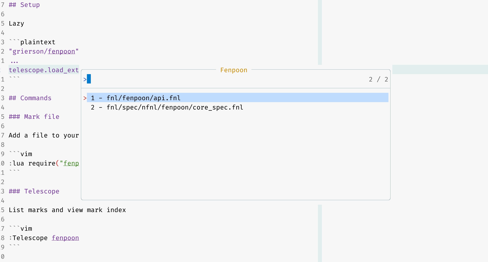

# Fenpoon

Clone of [ThePrimeagen/harpoon](https://github.com/ThePrimeagen/harpoon) written in fennel

(I know the name is awful. FENnel + harPOON.)



## Why

I wanted to create a nvim plugin + use fennel

## Should I use it?

No use [ThePrimeagen/harpoon](https://github.com/ThePrimeagen/harpoon)

## Setup

Lazy

```plaintext
"grierson/fenpoon"
...
telescope.load_extension('fenpoon')
```

## Commands

### Mark file

Add a file to your marks

```vim
:lua require("fenpoon.api").mark()
```

### Telescope

List marks and view mark index

```vim
:Telescope fenpoon
```

### Select a mark

Select a specific mark

```vim
:lua require("fenpoon.api").select(N)
```

Usally map 1,2,3,4 to frequent keys e.g

```vim
n <cmd>:lua require("fenpoon.api").select(1)<CR>
e <cmd>:lua require("fenpoon.api").select(2)<CR>
i <cmd>:lua require("fenpoon.api").select(3)<CR>
o <cmd>:lua require("fenpoon.api").select(4)<CR>
```

### Delete mark

Pressing `<c-d>` within Telescope will ask you to confirm deleting mark

## TODO

- Change id of mark (Move up, down)
